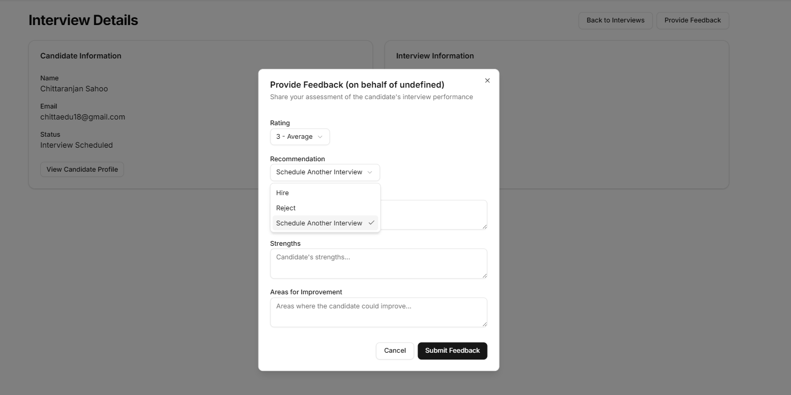
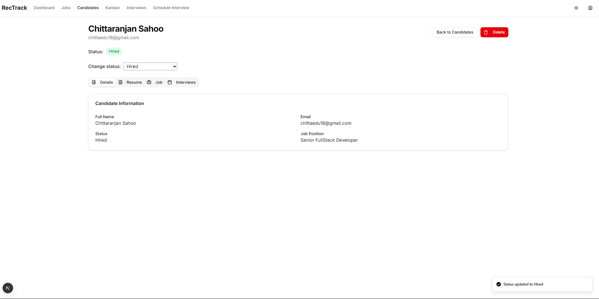

# Recruitment Tracking System

This is a modern recruitment tracking application built with Next.js that helps streamline the hiring process. The system provides comprehensive tools for managing candidate applications, interview scheduling, and hiring workflows.

## Features

- **Candidate Management**: Track and organize applicant information
- **Job Posting Management**: Create, edit, and manage job listings
- **Interview Scheduling**: Coordinate and schedule interviews with candidates
- **Application Tracking**: Monitor candidate progress through hiring stages
- **Dashboard & Analytics**: Visualize recruitment metrics and KPIs
- **User Role Management**: Different access levels for recruiters, hiring managers, and admins

## Tech Stack

- **Frontend**: Next.js, React
- **UI Components**: Shadcn-UI, Tailwind CSS
- **State Management**: React Context API
- **API Integration**: RESTful API for backend communication

## Application Screenshots

<div align="center">

### Authentication
<p>Modern authentication system with login and registration screens</p>


<br><br>

### Dashboard & Job Management
<p>Comprehensive dashboard showing key metrics and the job creation interface</p>


<br><br>

### Candidate Pipeline
<p>Kanban board for candidate tracking and candidate creation form</p>


<br><br>

### Candidate Management
<p>Comprehensive candidate board and interview scheduling interface</p>


<br><br>

### Interview Process
<p>Interview dashboard and detailed interview view</p>


<br><br>

### Feedback System
<p>Interview feedback collection and review screens</p>



<br><br>

### Workflow Management
<p>Candidate status tracking and workflow management</p>



</div>

## Getting Started

First, run the development server:

```bash
npm run dev
# or
yarn dev
# or
pnpm dev
# or
bun dev
```

Open [http://localhost:3000](http://localhost:3000) with your browser to see the application.

## Project Structure

```
src
├── components/       # Reusable UI components
├── app/              # App router pages and layouts
├── lib/              # Utility functions and shared logic
├── context/          # Auth-context management
└── types/            # Types Management 
```

## Environment Configuration

Create a `.env.local` file in the root directory with the following variables:

```
API_URL=your_backend_api_url
```

## Deployment

Follow the [Next.js deployment documentation](https://nextjs.org/docs/app/building-your-application/deploying) for hosting options.

## Contributing

Please read the contribution guidelines before submitting pull requests.